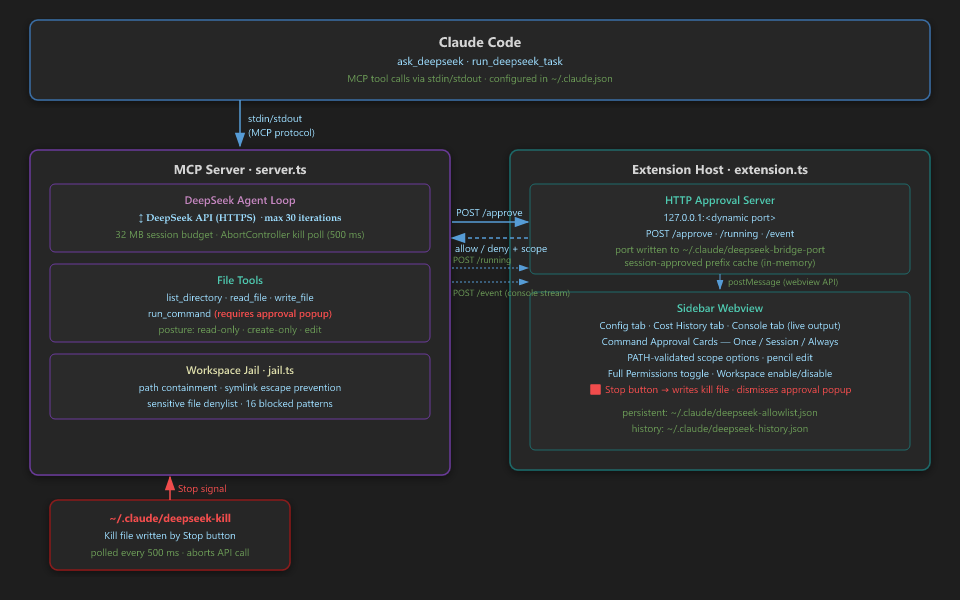

# ⚡ DeepSeek Bridge for Claude Code

**Offload token-heavy work from Claude to DeepSeek — automatically, sandboxed, and fully under your control.**

DeepSeek Bridge connects [Claude Code](https://claude.com/claude-code) to [DeepSeek](https://platform.deepseek.com) via the Model Context Protocol (MCP). When Claude hits a heavy chore — a multi-file refactor, code generation, mechanical edits, large-file analysis — it hands that work to DeepSeek at a fraction of the cost. Claude stays in charge: it plans, delegates, and reviews the result.

The difference from a plain MCP server: **Bridge installs a delegation policy into your `CLAUDE.md`, so Claude offloads the right work on its own — you don't have to say "use DeepSeek."**

> *Independent, community project — not affiliated with, endorsed by, or sponsored by Anthropic or DeepSeek.*

---

## How it works

1. On **Save & Connect**, Bridge writes a managed delegation-policy block to your `CLAUDE.md` and registers two MCP tools with Claude Code.
2. When a task is token-heavy and file-based, Claude calls `run_deepseek_task`. A sandboxed DeepSeek agent reads, writes, and lists files **inside your workspace only**.
3. The agent runs to completion — when its context fills up it summarises its own progress and keeps going (no manual resume). If it wants to run a shell command (e.g. tests), it asks you first.
4. Claude gets back a structured manifest — **a unified diff per modified file and the exit code of any command run** — so it can verify the work *without re-reading whole files*.

> **Data handling:** to do its work, your file contents and prompts are sent to DeepSeek's API (`api.deepseek.com`). See [Privacy & data handling](#privacy--data-handling) below.

---

## Installation

### Requirements
- [Claude Code](https://claude.com/claude-code) installed and running
- A [DeepSeek API key](https://platform.deepseek.com/api_keys) — free at platform.deepseek.com

### Steps
1. **Install** from the VS Code Marketplace — search **DeepSeek Bridge for Claude Code**.
2. **Open the sidebar** — click the ⚡ icon in the Activity Bar. (A Getting Started walkthrough also appears on first install.)
3. **Enter your DeepSeek API key.** You'll be asked to acknowledge that your code is sent to DeepSeek before anything is transmitted.
4. **Pick a model, a delegation aggressiveness, and a permission posture** — then click **Save & Connect**.
5. **Reconnect Claude Code** — run **DeepSeek Bridge: Reconnect Claude Code**, run `/mcp`, or reload the window.

That's it. Ask Claude to do something big — *"refactor everything in `src/` to use the new API"* — and it delegates the grind automatically.

> Model, posture, aggressiveness, and allow-list changes apply **immediately** — only an API-key change needs a reconnect.

---

## Features

### Automatic delegation (the seamless part)
Bridge writes a managed, fenced block into your `CLAUDE.md` telling Claude *when* to offload — tunable via **Delegation Aggressiveness** (Conservative / Balanced / Aggressive). The same policy backs the MCP server's `instructions` and the tool descriptions, so Claude reliably routes heavy work to DeepSeek without being told. The block is delimited with markers and never touches your own content; set `deepseekBridge.injectGuidance` to `off` to disable.

### Two tools

| Tool | What it does |
|------|-------------|
| `ask_deepseek` | Single Q&A — no file access. For self-contained, token-heavy reasoning or snippets. Honors automatic model switching. |
| `run_deepseek_task` | Autonomous file agent — reads/writes/lists files and (with approval) runs shell commands. Returns a manifest with **diffs + command exit codes**. |

### Review without re-reading
Every applied edit comes back as a **unified diff**; `dryRun` returns diffs for existing files and full content for new ones; any self-verification command's **exit code** is reported. Claude can trust the result without spending tokens re-reading the files — so the offload is a real net win. Optional `selfReview` runs one extra completeness pass for enumeration/indexing tasks.

### Context condensation
Around 65% of the model's 1M-token window the agent summarises its progress, compacts its history, and continues — so big tasks finish in one call. A `resumeId` only appears on the rare runaway/error exit.

### Per-call permission scoping
`posture` (`read` / `create-only` / `edit`, clamped to the server max), `writePaths` glob allow-list, and `dryRun` let Claude scope each delegation tightly.

### Command approval, done right
When DeepSeek wants to run a command, an inline card lets you approve the exact command or any command from that executable, for Once / this Session / Always. Broad approvals of scriptable tools (`git`, `node`, `npm`, …) are flagged as arbitrary-code-execution. Chained commands (`&&`, `||`, `;`) are split and every segment must match.

### Native Settings + everything live
All settings are exposed under `deepseekBridge.*` in the VS Code Settings UI — discoverable, searchable, syncable via Settings Sync, and overridable per-workspace. The sidebar is a friendly editor over the same settings.

### Built for scale
Per-window signal files (Stop in one window can't kill another's task), per-session auth token on the local approval channel, a single-in-flight task guard, atomic cost-history writes, resume-file garbage collection, MCP progress heartbeats on long tasks, and a version-independent server path so an extension auto-update never silently strands the bridge.

### Live Console & Cost History
The Console tab streams tool calls, token usage, and condensation events. The History tab shows per-task cost and a Claude comparison; cache-hit ratio is shown when DeepSeek reports it.

### Command palette
`Open Settings`, `Set API Key`, `Open Cost History`, `Stop Running Task`, `Enable / Disable for This Workspace`, `Reconnect Claude Code`, and `Copy Diagnostics`.

---

## Security

DeepSeek runs in a strict sandbox:

- **Workspace jail** — every path is canonicalized and confirmed inside your workspace. UNC paths, drive-letter escapes, symlink traversal, alternate data streams, and `..` tricks are rejected.
- **Sensitive-file denylist (non-exhaustive)** — blocks common secret files even inside the workspace: `.env`, `.ssh/`, `.aws/`, `.kube/`, `kubeconfig`, `.npmrc`, `.netrc`, `.pgpass`, `.git-credentials`, `auth.json`, `*.pem`/`*.key`, `*.tfstate`/`*.tfvars`, `wp-config.php`, `*.sqlite`, `.git/`, and more. A path denylist can't catch everything — review what's in your workspace before delegating.
- **The agent has no network tools of its own** — it can only read/write files and run approved commands. (Your code is still sent to DeepSeek's API to perform the task — see below.)
- **`run_command` is real execution** — approving a scriptable tool (`git`, `node`, …) grants arbitrary code via that tool, which can read files the denylist protects. The approval card warns you; prefer "Exact command only".
- **Authenticated local channel** — the approval/event server is bound to `127.0.0.1`; the security-sensitive approve action requires a per-session token (the display-only console/status feed is left open so the UI is never silently dark).
- **Audit log** — every tool call is logged (with full args) to `~/.claude/deepseek-audit/<workspace>.log`, outside your repo so it can't be committed.

---

## Privacy & data handling

DeepSeek Bridge is an LLM bridge: **to perform a task, your workspace file contents, prompts, and command output are transmitted to DeepSeek's API** (`api.deepseek.com`, operated by DeepSeek, Hangzhou, PRC). The phrase "no network" elsewhere refers only to the agent's tool set, not to this transmission.

- You're asked to **explicitly consent** the first time you save an API key. Nothing is sent before that.
- The API key is stored in VS Code SecretStorage and mirrored to `~/.claude.json` (the file Claude Code reads).
- Don't use Bridge on code you cannot share with a third-party service. Review DeepSeek's [privacy policy](https://platform.deepseek.com/downloads/DeepSeek%20Privacy%20Policy.html) and your organisation's data-egress rules.
- Point `deepseekBridge.baseUrl` at a regional mirror, self-hosted DeepSeek, or a corporate LLM proxy if required.

---

## Pricing

DeepSeek caches prompt prefixes automatically (no config, no cache-write fee); cache hits bill at a small fraction of the miss rate, which the append-only agent loop maximises.

| Model | Input (cache hit) | Input (cache miss) | Output |
|-------|-------------------|--------------------|--------|
| DeepSeek V4 Flash | $0.0028 / 1M | $0.14 / 1M | $0.28 / 1M |
| DeepSeek V4 Pro | $0.003625 / 1M | $0.435 / 1M | $0.87 / 1M |

> Estimates as of 2026-06-27 — verify against the official [DeepSeek pricing page](https://api-docs.deepseek.com/quick_start/pricing). The Cost History tab stamps the pricing date.

The History tab compares against Claude (Haiku 4.5 $1/$5, Sonnet 4.6 $3/$15, Opus 4.8 $5/$25 per 1M). The displayed savings are a **gross** token-cost delta and exclude Claude's own review overhead, so real net savings are somewhat lower.

---

## Configuration reference

All settings live under `deepseekBridge.*` (Settings UI) and in the sidebar:

| Setting | Description |
|---------|-------------|
| `model` | `deepseek-v4-flash` (recommended) or `deepseek-v4-pro` |
| `modelAuto` | `no` / `ask` / `yes` — may Claude switch models per task |
| `posture` | `edit` or `read-only` — max file access |
| `delegationAggressiveness` | `conservative` / `balanced` / `aggressive` — how eagerly Claude offloads |
| `injectGuidance` | `workspace` / `user` / `off` — where the delegation block is written |
| `allowCommands` | Shell prefixes pre-approved without a popup |
| `fullPermissions` | ⚠️ Auto-approve all commands (trusted environments only) |
| `baseUrl` | OpenAI-compatible endpoint (mirror / self-host / proxy) |

### Per-call parameters (used by Claude)

| Parameter | Type | Description |
|-----------|------|-------------|
| `posture` | `read` \| `create-only` \| `edit` | Permission level (clamped to server max) |
| `writePaths` | `string[]` | Glob allow-list of writable paths |
| `dryRun` | `boolean` | Return proposed diffs without applying |
| `selfReview` | `boolean` | Extra completeness pass before finishing |
| `model` | `flash` \| `pro` | Request a model (subject to `modelAuto`) |
| `maxIterations` | `number` | Iteration cap (default/max 500) |
| `resumeId` | `string` | Resume a paused task |

---

## Links

- [GitHub repository](https://github.com/DamienTheOmen/Claude-to-DeepSeek-Bridge)
- [Report an issue](https://github.com/DamienTheOmen/Claude-to-DeepSeek-Bridge/issues)
- [Security policy](https://github.com/DamienTheOmen/Claude-to-DeepSeek-Bridge/blob/main/SECURITY.md)
- [Contributing](https://github.com/DamienTheOmen/Claude-to-DeepSeek-Bridge/blob/main/CONTRIBUTING.md)
- [DeepSeek API keys](https://platform.deepseek.com/api_keys)
- [Claude Code](https://claude.com/claude-code)

---

### Disclaimer & license

This is an independent, open-source project licensed under [MIT](LICENSE). It is **not
affiliated with, endorsed by, or sponsored by Anthropic or DeepSeek.** "Claude",
"Claude Code", "Anthropic", and "DeepSeek" are trademarks of their respective owners
and are used here only to describe interoperability. Your code is transmitted to
DeepSeek's API to perform tasks — see [Privacy & data handling](#privacy--data-handling).
